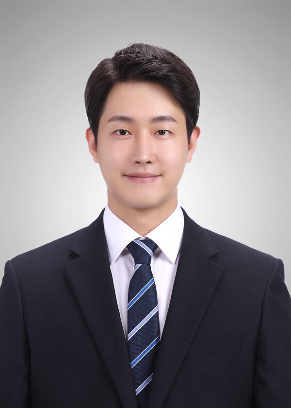

<strong><a href="index_en.html">CLICK HERE FOR ENGLISH VERSION (English)</a></strong>

<section id="about">
  <h2>자기 소개</h2>
  
  <h3>황영준</h3>
  <h4>KT 미디어 AI 연구 엔지니어</h4>
  
서강대학교 석사 학위를 보유한 AI 컨설턴트 전문가로, AI를 활용하여 복잡한 비즈니스 문제를 해결하는 데 특화되어 있습니다. 혁신적인 AI 솔루션 개발 및 구현 경험이 입증되었습니다.

</section>

<section id="education">
  <h2>학력</h2>
  

    <h4>서강대학교</h4>
    
<strong>컴퓨터 과학 석사</strong> (2020 - 2022)

    
<em>"AI 및 고급 컴퓨팅에 중점을 둔 석사 학위."</em>

    <ul>
      <li>데이터 마이닝</li>
      <li>수치 컴퓨팅 및 GPU 프로그래밍</li>
      <li>동영상 해석</li>
      <li>신경회로망</li>
      <li>멀티미디어 특론</li>
      <li>고급 알고리즘</li>
      <li>임베디드 컴퓨터 구조</li>
    </ul>
  

  

    <h4>서강대학교</h4>
    
<strong>컴퓨터 과학 학사</strong> (2014 - 2020)

    
<em>"1969년 설립, "그대 서강의 자랑이듯, 서강 그대의 자랑이어라.""</em>

    
서강대학교 재학 중 팀워크, 마감 기한 엄수 등 핵심 역량을 배웠습니다. 대학 생활을 즐겁게 보냈으며 건강한 일과 삶의 균형에 대해 많이 배웠습니다.   주요 과목: 자료구조, 알고리즘 설계 및 분석, 프로그래밍 언어, 운영체제, 인터넷 프로그래밍, 고급 소프트웨어 실습 등.

  

</section>

<section id="experience">
  <h2>경력</h2>
  

    <h4>KT</h4>
    
<strong>R&D (미디어 사업 본부)</strong> (2022.07 - Present)

    
<em>"사용자 경험 향상을 위한 미디어 기술 혁신."</em>

    <ul>
      <li>
        <strong>2022년: 지니 TV AI 큐레이션 뷰잉 서비스 (프로젝트: 메타바)</strong>
        <ul>
          <li>지니 TV 'AI 골라보기' 서비스의 '메타바' 프로젝트 주도.</li>
          <li>서비스 핵심 행동 모델 엔진 설계.</li>
          <li>데이터 수집 프로세스 관리 및 AI 모델 직접 학습.</li>
        </ul>
      </li>
      <li>
        <strong>2023년: 오브제 북 PoC 및 매직 플랫폼 상용 출시</strong>
        <ul>
          <li>밀리의 서재와 협력하여 '오브제 북' PoC 성공적으로 완료.</li>
          <li>KT 핵심 미디어 기술을 통합한 '매직 플랫폼' 상용 버전 기획 및 성공적 출시.</li>
        </ul>
      </li>
      <li>
        <strong>2024년: AI 숏폼 영상 생성</strong>
        <ul>
          <li>AI 기반 숏폼 영상 생성 시스템 아키텍처 설계.</li>
          <li>해당 시스템 PoC 성공적 완료.</li>
          <li>이후 해당 AI 숏폼 영상 생성 기술 상용화 주도.</li>
        </ul>
      </li>
      <li>
        <strong>현재 업무:</strong>
        <ul>
          <li>현재 2개 프로젝트 진행 중 (세부 정보 비공개).</li>
        </ul>
      </li>
    </ul>
  

  

    <h4>Magic Eco</h4>
    
<strong>소프트웨어 엔지니어 (매니저)</strong> (2019.01 - 2019.08)

    
<em>"현대 NGV와 자율주행 미니카 프로젝트 참여 (2020년 7월 - 2020년 8월)"</em>

    
변화하는 세상에는 교육이 필요합니다. 어떤 대기업이라도 세상을 피해갈 순 없습니다. 자율주행차 교육 프로젝트에서 음성인식과 영상처리 파트를 담당했고 그 모든 과정에서 여러 사람들과 협업했습니다. 4명이 한 팀이였고 팀 리더 역할을 맡았습니다. 새로운 기술을 교육 프로젝트에 적용시키며 배우는 그 과정을 잘 즐겼습니다.

  

</section>
